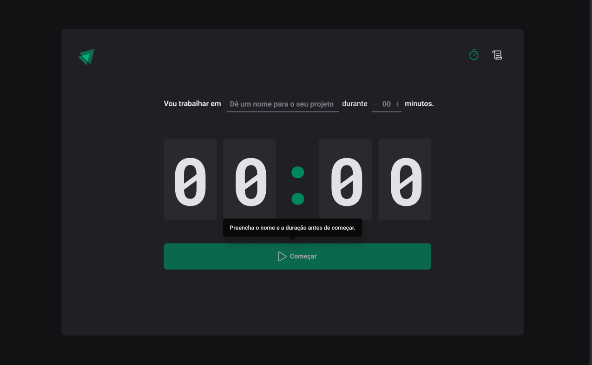
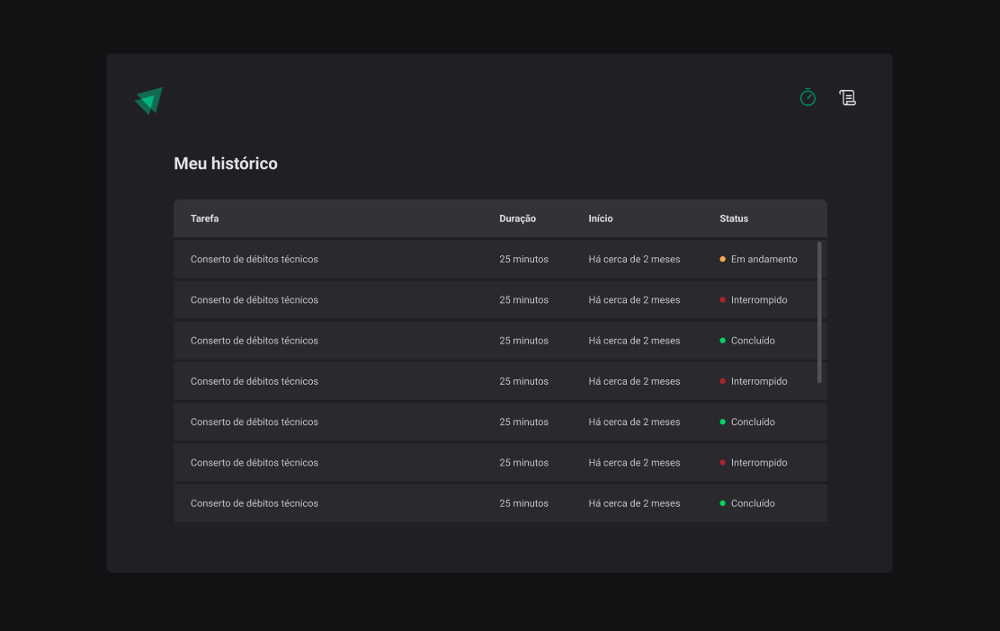

<h1 align="center" >
  
  Timer
</h1>

## **💻** Projeto

Começar um projeto e perder o foco: eis uma preocupação do desenvolvimento de software. Foco é a principal ferramenta que o dev deve ter no seu dia a dia de trabalho.

Para conclusão de módulo, a fim consolidar ainda mais meus conhecimentos sendo alinhado com as novas e melhores práticas e tecnologias disponíveis no mundo da tecnologia, realizei durante o programa de aceleração “Ignite - ReactJS”, promovido pela Rocketseat, uma aplicação Frontend de um Temporizador, onde pode ter acesso aos históricos anteriores, salvos em LocalStorage. O Layout - responsivo - foi criado utilizando ReactJS, Styled Components, React Hook Form, React Router Dom, React Hooks (como o useReducer), Context API, etc. 

<p align="center">
  
</p>

<p align="center">
  
</p>


## Tecnologias utilizadas

- [Vite](https://vitejs.dev/)
- [Typescript](https://www.typescriptlang.org/)
- [ReactJS](https://pt-br.reactjs.org/)
- [React Router DOM](https://reactrouter.com/en/main)
- [Styled Components](https://styled-components.com/)
- [Immer](https://github.com/immerjs/immer)
- [React Hook Form](https://react-hook-form.com/)
- [Date-fns](https://date-fns.org/)
- [Zod](https://github.com/colinhacks/zod)

## **🔖** Layout

Você pode visualizar o layout do projeto através do link abaixo:

- [Figma](https://www.figma.com/community/file/1127351821076435124)

## **🚀** Como Executar

Como o repositório e siga o passo a passo de cada stack.

```bash
## Clone o projeto em sua máquina
git clone https://github.com/srsouzaj/ignite-time.git

# Acessar o projeto no terminal
$ cd ignite-time

# Instalar as dependências
$ npm install

# Executar o servidor em modo de desenvolvimento
$ npm run dev
```

## 📝 License

Esse projeto está sob a licença MIT. Veja o arquivo [LICENSE](https://github.com/srsouzaj/ignite-time/blob/main/LICENSE.md) para mais detalhes.

Feito com ❤️ por Jorge de Souza
